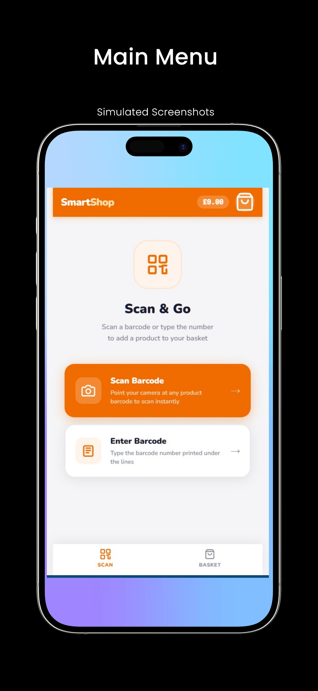
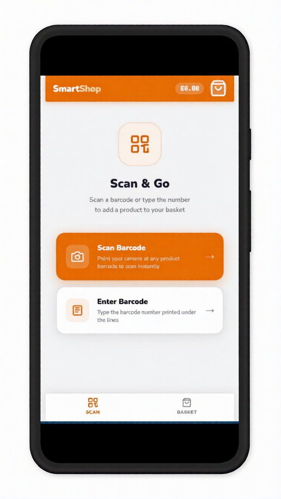
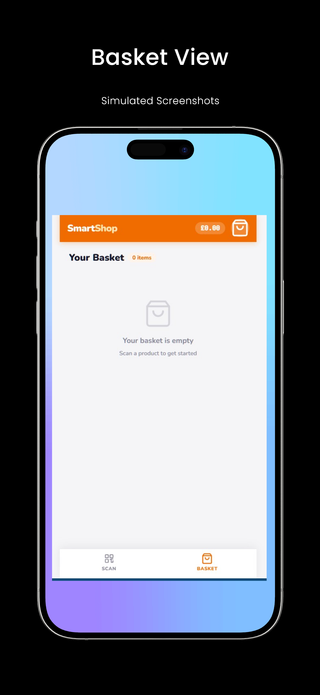
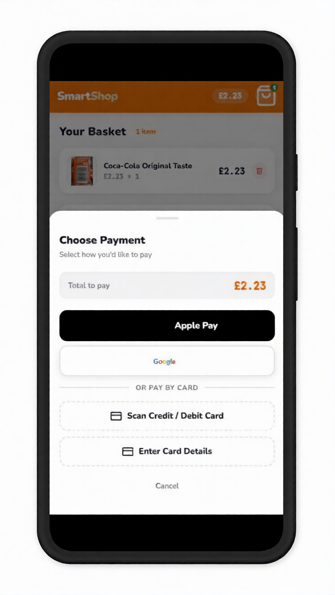
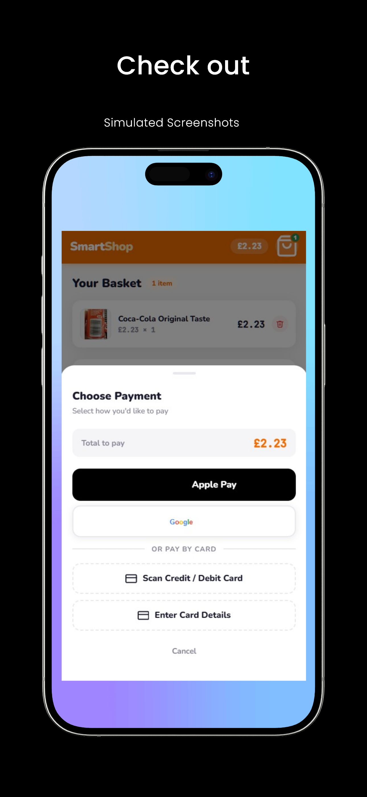
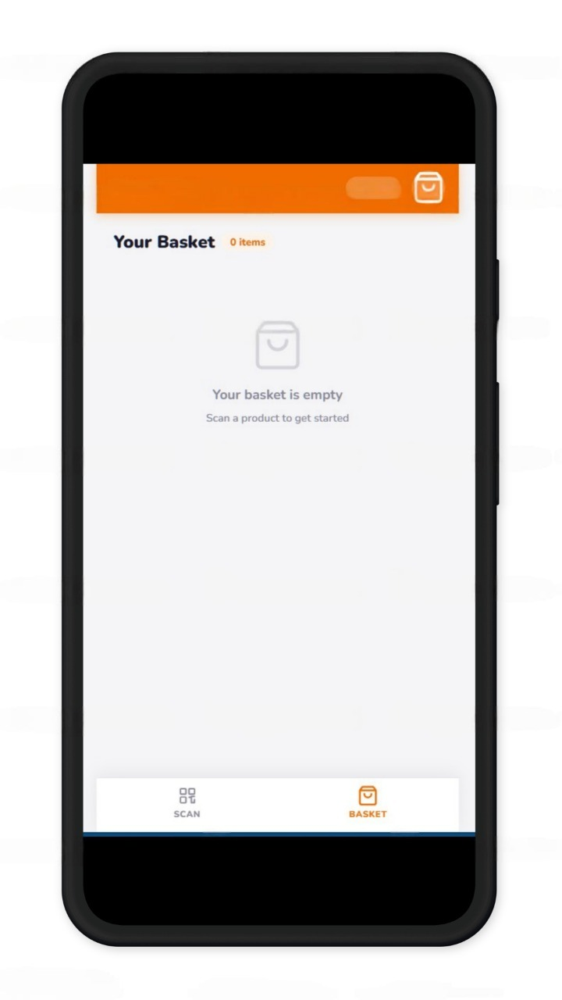

# SmartShop App

Speed thru checkout

## Main Menu (iPhone)


Simulated Screenshot of the **Main Menu** on **iPhone**, with the option to scan a barcode or enter one manually.

## Scan & Go (Android)


Simulated Screenshot showing the **Scan & Go** feature on **Android**, allowing users to add products by scanning or entering a barcode.

## Basket View (iPhone)


Simulated Screenshot of the **Basket View** on **iPhone**, where you can see your items and proceed with checkout.

## Checkout (Android)


Simulated Screenshot of the **Checkout** process on **Android**, where the user selects their payment method.

## Payment Methods (iPhone)


Screenshots showing the different **payment methods** available, including Apple Pay and card scanning on **iPhone**.

## New Screenshots

### Checkout View with Items (Android)


Checkout view on **Android**, showing the added item in the cart, ready for payment.

### Final Screen for Payment (iPhone)


Final screen on **iPhone** after selecting payment methods, showing the confirmation and total amount.

---

## Features

- 📷 Live barcode scanning via camera (Quagga.js)
- 🔢 Manual barcode entry
- 🛒 Real product data from Open Food Facts API (no key required)
- 🍫 6 bundled example products (works offline)
- 💳 Payment sheet with Apple Pay / Google Pay (OS-detected) + card scan UI
- 📱 Mobile-first responsive design

## Usage

Just open `smartshop.html` in a browser — no build step, no server needed.

```bash
git clone https://github.com/karthic180/smartshop.git
cd smartshop
open smartshop.html
Tech Stack
Thing	License
Quagga.js
	MIT
Open Food Facts API
	ODbL
Nunito Font
	OFL
JetBrains Mono
	OFL
Attribution

Product data provided by Open Food Facts
 — a free, open, collaborative database of food products from around the world.

License

MIT — see LICENSE


### Key Sections:
1. **Screenshots**: Platform-specific screenshots for **iPhone** and **Android**.
   - **Main Menu**, **Scan & Go**, **Basket View**, **Checkout**, and **Payment Methods** are all included for both platforms.
   - **New Screenshots** for checkout and final payment view with items are also labeled correctly.
  
2. **Features**: Describes the core features of your SmartShop app, including barcode scanning, payment methods, and responsive design.

3. **Usage**: Instructions to open the app in a browser, with the simple command to clone and open the `smartshop.html`.

4. **Tech Stack**: Lists the technologies used in the project, including **Quagga.js** for barcode scanning and **Open Food Facts API** for product data.

5. **Attribution**: Credits **Open Food Facts** for providing product data.

6. **License**: MIT License.

### How to Use:
1. Clone the repository:
   ```bash
   git clone https://github.com/karthic180/smartshop.git
   cd smartshop
   open smartshop.html